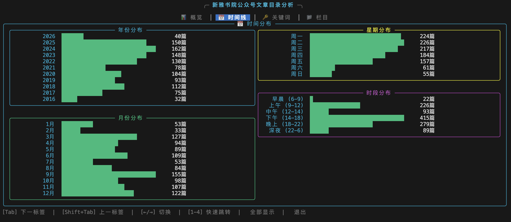
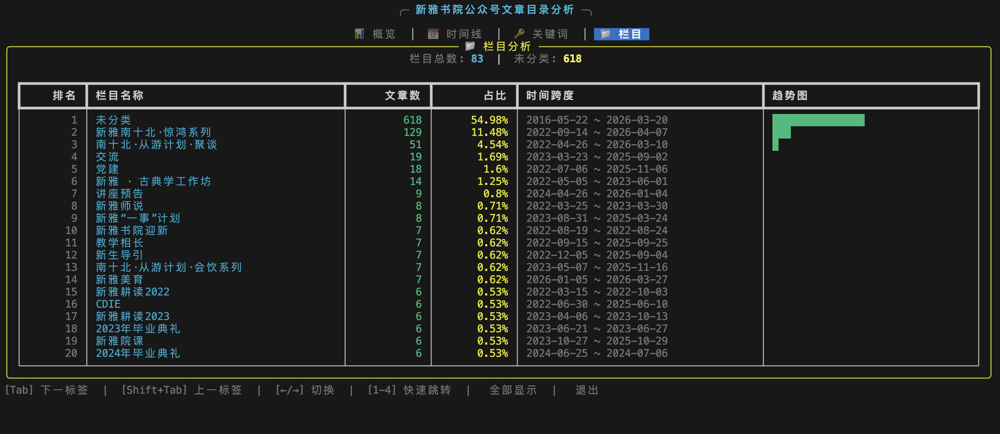

# Tokenized-XY

清华大学新雅书院公众号文章 Token 化项目

> Deliver Xinya's own token!

---

## Overall plan

Tokenize and organize all resource about Xinya College

### 数据洞察

| 指标 | 数值 |
|------|------|
| 文章总数 | 1,124 篇 |
| 时间跨度 | 2016-05-22 ~ 2026-04-07（3,607天，近10年）|
| 栏目数 | 83 个 |
| 系列文章 | 208 篇 |

### 发布规律

- **工作日集中发布**：周一~周四占 76%，周末较少
- **主要栏目**：
  - 未分类（618篇，55%）
  - 新雅南十北·惊鸿系列（129篇）
  - 南十北·从游计划·聚谈（51篇）
- **高频关键词**：南十北、惊鸿、实践、学术、聚谈、活动

---

## 功能特性

### 1. Menu Lens 分析模块

基于 `jieba` 专业中文分词的分析引擎：

- **数据加载**：JSON 数据加载与验证，Unix 时间戳自动转换
- **标题分析**：长度分布、高频关键词提取、系列文章识别
- **摘要分析**：覆盖率统计、关键词提取
- **时间分析**：年份/月份/星期/时段分布
- **栏目分析**：栏目统计、时间跨度计算

### 2. 交互式 CLI 可视化面板

基于 `rich` 库构建的现代化终端面板：

```bash
bash scripts/menu_dashboard.sh
```

#### 面板预览





#### 交互控制

| 按键 | 功能 |
|------|------|
| `Tab` | 切换到下一标签 |
| `Shift+Tab` | 切换到上一标签 |
| `← / →` | 左右切换标签 |
| `1-4` | 快速跳转到对应标签 |
| `a` | 显示所有面板（静态模式）|
| `q` | 退出面板 |

---

## 安装与使用

### 安装依赖

```bash
# 创建 conda 环境
conda create -n tokenized_xy python=3.10
conda activate tokenized_xy

# 安装依赖
pip install jieba rich textual
```

### 使用方法

#### 1. 运行交互式面板

```bash
bash scripts/menu_dashboard.sh
```

#### 2. 静态模式（直接输出所有面板）

```bash
bash scripts/menu_dashboard.sh --static
```

#### 3. 使用轻量数据（3篇，用于调试）

```bash
bash scripts/menu_dashboard.sh --lite
```

#### 4. 运行基础分析脚本

```bash
bash scripts/menu_lens.sh --lite   # 轻量数据
bash scripts/menu_lens.sh --full   # 完整数据
```

---

## 项目结构

```
Tokenized-XY/
├── .claude/
│   └── Agent.md              # 项目文档
├── data/
│   ├── official_account_menu_lite.json    # 轻量数据（3篇）
│   └── official_account_menu.json         # 完整数据（1,124篇）
├── src/
│   ├── menu_lens/            # 核心分析模块
│   │   ├── __init__.py
│   │   ├── loader.py         # 数据加载器
│   │   ├── analyzer.py       # 数据分析器（jieba分词）
│   │   ├── stats.py          # 报告生成器
│   │   └── dashboard/        # CLI可视化面板
│   │       ├── __init__.py
│   │       ├── app.py        # 主应用（交互式/静态）
│   │       └── panels.py     # 面板组件
│   └── menu_lens_demo.py     # 演示脚本
├── scripts/
│   ├── menu_lens.sh          # 基础分析脚本
│   └── menu_dashboard.sh     # 交互式面板脚本
├── reports/                   # 生成的分析报告
└── README.md
```

---

## 数据格式

每篇文章包含以下字段：

```json
{
  "aid": "文章唯一标识",
  "title": "标题",
  "digest": "摘要",
  "link": "原文链接",
  "cover": "封面图URL",
  "create_time": 1234567890,  // Unix时间戳
  "update_time": 1234567890,
  "album_id": "所属专辑ID",
  "appmsg_album_infos": [...], // 专辑信息
  "content": "",  // 文章内容（待抓取）
  "comments": []  // 评论（待抓取）
}
```

---

## 技术实现

### 中文分词

使用 `jieba` 进行专业中文分词，针对新雅书院场景优化：

- **自定义词典**：新雅书院、南十北、通识教育、从游计划等
- **停用词过滤**：机构名（清华、大学、新雅）、虚词、数字等
- **智能提取**：过滤单字、纯数字、标点符号

### CLI 可视化

基于 `rich` 库构建：

- **Live 模式**：实时渲染交互式界面
- **TTY 检测**：非交互式环境自动回退到静态模式
- **模块化面板**：4 个独立面板组件，易于扩展

---

## 项目目标

- [x] 清洗和解析公众号文章 metadata
- [x] 构建数据分析模块（menu_lens）
- [x] 构建 CLI 可视化面板
- [ ] 抓取文章内容（目前只有 metadata）
- [ ] 将文本内容 token 化，生成训练数据集
- [ ] 构建适用于 AI 模型的结构化数据

---

## 许可证

MIT License

---

## 致谢

- 数据来源：清华大学新雅书院公众号
- 分词支持：[jieba](https://github.com/fxsjy/jieba)
- 终端 UI：[rich](https://github.com/Textualize/rich)
